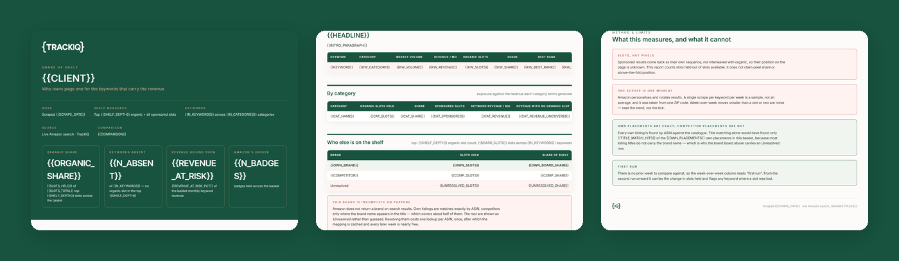

# TrackIQ: Amazon Share of Shelf

Answers one question a week: **for the keywords that actually make this brand
money, how much of page one does it own, and who has the rest?**

Rank tracking tells you where one ASIN sits. This tells you how much of the
page the brand occupies, against everyone else on it.

Built as an [Agent Skill](https://code.claude.com/docs/en/skills). Runs in
Claude Code, Claude web, Claude desktop and ChatGPT from the same folder.

---

## ⚠ This skill needs a scraper connection

Unlike the other TrackIQ skills, this one **cannot run on first-party data
alone**. Live Amazon search results are the only source that shows the shelf
as a shopper sees it.

| What | Why | Cost |
|---|---|---|
| **Oxylabs scraper** | `search_keyword` for the live results page | **1 credit per keyword, per run** |
| | `get_product` for brand resolution | **1 credit per ASIN**, one-off per brand |
| **TrackIQ MCP** | `list_marketplaces`, `get_product_performance` — your own ASIN list, which is what makes own placements exact | included |

**There is no fallback.** Page one cannot be approximated from rank tracking,
and the skill says so rather than pretending otherwise.

A 40-keyword weekly basket is 40 credits a week, plus a one-off resolution
pass the first time you run a brand. The skill states the run's credit cost in
its output. Note that budget can't be checked programmatically — the scraper
exposes no balance endpoint — so the skill warns you before a first run rather
than discovering the limit mid-report.

---

## Powered by the TrackIQ MCP

The revenue weighting comes from your live Amazon account through the
**[TrackIQ MCP](https://trackiq.com/mcp)** — 16 tools connecting your AI
assistant to Amazon data. **[Get access →](https://trackiq.com/mcp)**

---

## What you get



*One dashboard, three views: the cover with organic share and revenue at risk,
the keyword table with the category rollup and competitor board, then what the
measurement can and cannot tell you.*

Per keyword, per week: how many of the top 20 **organic** slots the brand
holds, how many **sponsored**, its **best rank**, and whether it has the
**Amazon's Choice** badge. Rolled up by product category and by week-over-week
movement.

### Two things make it more than a visibility report

**It's weighted by revenue, not volume.** The basket comes from
[Category Priority Keywords](https://github.com/TrackIQ-HQ/trackiq-amazon-category-priority-keywords),
so every row carries what that term earns per month. The expensive gap sorts to
the top — a term with tens of thousands of weekly searches and zero presence
lands first, ahead of a term you already own.

**It names the competitors holding the slots**, from Amazon's own brand facet
rather than from guesswork on listing titles.

### What it states plainly about its own limits

- **It counts slots, not pixels.** Sponsored results come back in their own
  sequence, not interleaved with organic, so their position on the page is
  unknown. No claim about pixel share or above-the-fold position.
- **One scrape is a sample, not an average.** Amazon personalises and rotates
  results. Week-over-week moves smaller than a slot or two are noise.
- **Own placements are exact; competitor placements are not.** Your listings
  are matched by ASIN against the catalogue. Competitors are only identified
  where the brand facet names them — the rest are shown as *Unresolved* rather
  than guessed.

---

## Install

### Claude Code

```
/plugin marketplace add TrackIQ-HQ/amazon-seller-skills
/plugin install trackiq-amazon-share-of-shelf@trackiq
```

### Claude web, desktop, mobile

1. Download the `.zip` from the
   [latest release](https://github.com/TrackIQ-HQ/trackiq-amazon-share-of-shelf/releases)
2. **Settings → Capabilities → Skills** (code execution must be on)
3. **Create skill → Upload a skill**, choose the `.zip`
4. Toggle it on

### ChatGPT

Same zip. **Plugins → Skills → Create → Upload from your computer.**

---

## Setup

Answers live in `account.md`, copied from
[`assets/account.example.md`](skills/trackiq-amazon-share-of-shelf/assets/account.example.md).
**Every TrackIQ skill reads the same file.**

You also need a **keyword basket**. Run
[Category Priority Keywords](https://github.com/TrackIQ-HQ/trackiq-amazon-category-priority-keywords)
first so every keyword carries a revenue figure — that's what turns a
visibility table into a priority list.

## Delivery

Asked once and stored in `account.md`: **in-chat** (default), **file**,
**Slack**, **n8n** or **email**. Anything leaving the chat confirms with you
first and falls back to in-chat, with a note.

## When to run it

Weekly, on a fixed day. The week-over-week column is the point, and it only
works if the cadence is steady. The first run reads "first run" in that column
and establishes the baseline.

---

## Customizing

| To change | Edit |
|---|---|
| Brand, basket, delivery | `account.md` — no skill edits |
| Shelf depth, brand attribution, the metrics | `assets/method.md` |
| The call sequence, credit model and caching | `assets/pulls.md` |
| The pre-send checks | `assets/checks.md` |
| The dashboard shell | `assets/dashboard-template.html` |

Two rules are load-bearing.

**An empty scrape is a failed call, not a zero.** Retry it; if it still fails,
mark the keyword "not scraped" rather than reporting the brand as absent. That
one mistake turns a network blip into a fabricated visibility collapse.

**Never infer a brand from a title that merely mentions it.** A product type
appearing in a listing title is the product, not the brand. Unresolved is an
honest answer; a guess is not.

---

## Contributing

```bash
python scripts/validate.py    # must exit 0 before any commit
python scripts/build.py       # writes dist/ zip + registry.json
```

Read [AUTHORING.md](https://github.com/TrackIQ-HQ/amazon-seller-skills/blob/main/AUTHORING.md)
before proposing changes.

## License

MIT. See [LICENSE](LICENSE).
